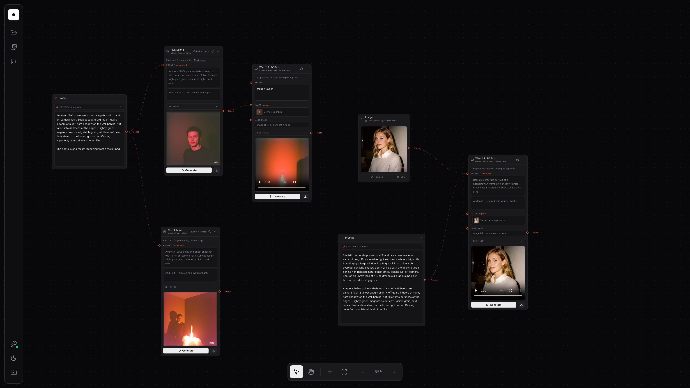

# Repliflow

A node canvas for generating images, video, audio and 3D with
[Replicate](https://replicate.com/explore). Wire a prompt into a model, wire that model's output
into the next one, and keep the whole chain on one canvas instead of in a folder of downloads.



```bash
npm install
npm run dev
```

Then add your Replicate API token via the key icon in the left rail. Grab one at
[replicate.com/account/api-tokens](https://replicate.com/account/api-tokens). It is kept in
`localStorage` and never leaves your machine except as the `Authorization` header on proxied
API calls.

## The canvas

**Right-click the canvas** to open the node menu — search across the whole catalog, or drill into
Image / Video / Audio / 3D / Utility → group → model, plus local Effects.
The bottom toolbar switches between select and pan, adds nodes, fits the view, and zooms.

There are four kinds of node:

- **Prompt** holds text. The *Start from a template* dropdown appends a written-out starting
  prompt — photography, illustration or motion — rather than replacing what you already typed.
  Drag its right handle into a model node to feed it.
- **Image** is your own image: upload a file or paste a URL. Uploads stay local.
- **Model** shows the model's real inputs, runs the prediction, and previews the result inline
  (image, video, audio player, 3D download, or text). If a price is known it is shown next to
  the name, and the model page is one click away.
- **Effect** applies a local pixel transform — see below.

Each media input on a model node has its own target handle, so you can drop an edge straight onto
*image* or *last image* and control first-frame/last-frame wiring explicitly. When a prompt node
is connected, the model node still offers a small **Add to it** field: what you type there is sent
as the connected prompt plus your addition on a new line, so one prompt can drive several variants.

**Chaining** works by output type: an image node feeds anything with an image input, an audio node
feeds a lipsync model, a captioning model's text feeds a prompt input, and so on.

## Starter templates

An empty canvas offers a few pre-wired graphs instead of a blank page —
prompt → image, prompt → video, image → image (Flux Kontext), image → video (Kling), generate then
cut the background out, and a cheap video test that iterates prompts on Wan before you pay for
Veo or Sora. They are defined in `src/lib/templates.ts`.

## Effects

The **Effects** section of the node menu holds local image transforms — halftone, ASCII, dither,
pixelate, posterize, duotone, scanlines. These are deterministic pixel operations, so they run on
a canvas in the browser rather than as predictions: instant, free, and repeatable. Parameters
re-apply live as you drag them.

Because reading pixels needs a same-origin image, effect nodes work from the cached blob rather
than the delivery URL. Each effect node keeps one asset (re-running overwrites it) so tweaking a
slider doesn't flood the gallery. Feeding an effect result back into a Replicate model works —
the blob is converted to a data URI on the way out.

Add one in `src/lib/effects.ts`: a name, a parameter list, and an `apply` that draws to a canvas.

## Projects

Projects are stored in IndexedDB and autosave about half a second after you stop editing. The
**Projects** panel in the left rail switches, creates, duplicates, renames and deletes them; the
last opened project reopens on launch.

Generated files are downloaded and cached as blobs alongside the project, because Replicate's
delivery URLs expire roughly an hour after a run. If that download is blocked, the node falls
back to the remote URL and the preview will break once it expires.

## Gallery and saving files

The **Gallery** panel lists every generation newest-first, scoped to all projects or just this
one, with previews, re-download and delete.

Auto-download can be toggled there. By default files land in your normal downloads folder; in
Chromium you can instead nominate a folder once and everything is written into a `repliflow/`
subfolder inside it. A plain `<a download>` cannot target a subfolder, so this uses the File
System Access API and falls back to an ordinary download elsewhere (`src/lib/fs.ts`).

## Sharing and backing up a canvas

The Projects panel copies the canvas as a single pasteable share code, or writes it to disk as a
`<project>.repliflow.json` file — the **Download** button for the open canvas, the hover icon on
any row for the others. The import button in the left rail takes either back in: paste the code,
or open the file. Only
the structure travels — prompts, model choices, settings and edges — never generated output or
local asset keys, which mean nothing on another machine. Uploaded images are dropped too; a
remote URL survives. Models or effects the receiving build doesn't know about are skipped and
reported rather than failing the import, and every field is validated because a share code is
untrusted input (`src/lib/share.ts`). The downloaded file is the same graph as readable JSON, so
it is diffable and hand-editable; it goes to your nominated folder if you have one, otherwise to
your normal downloads.

## Account and usage

The **usage** panel reads your Replicate account and recent predictions: run count, compute time,
success/failure split, activity over the last day and week, and your most-used models. Replicate's
API exposes no billing or cost data, so spend is not shown — there is a link to your billing page
instead of a guess.

## Model inputs are fetched, not hardcoded

`src/lib/models.ts` only records a model's slug, menu placement, and what it outputs — roughly 190
curated models across image, video, audio, 3D and utility. The actual input fields come from the
model's OpenAPI schema on Replicate, fetched and normalized at runtime by `src/lib/schema.ts`. So
the knobs on a node always match the live model, and adding a model is a one-line change.

The schema also decides which input receives an upstream connection: fields with `format: uri`
are classified as image / video / audio by name, and the matching upstream node fills them.

Pricing is the one thing that can't be fetched — Replicate publishes no rates through its API and
model pages render them client-side — so a small hand-maintained table in `models.ts` labels the
models it knows, and everything else shows nothing rather than a guess.

## Stack

- Vite + React 19 + TypeScript
- Tailwind v4 with shadcn/ui conventions (`components.json`, `@/components/ui`)
- `@xyflow/react` for the canvas, `zustand` for graph and project state, TanStack Query for
  account and usage reads
- Light, dark and follow-the-system themes, cycled from the left rail

## The Replicate proxy

`api.replicate.com` sends no CORS headers, so the browser cannot call it directly. The Vite dev
server proxies `/replicate/*` to it (see `vite.config.ts`). A production deployment needs an
equivalent server-side proxy — the static `dist/` build alone will not reach the API.

Predictions are created against a model's `latest_version` when one is published, and against the
model-scoped endpoint otherwise (official models do not expose versions). See `src/lib/replicate.ts`.
